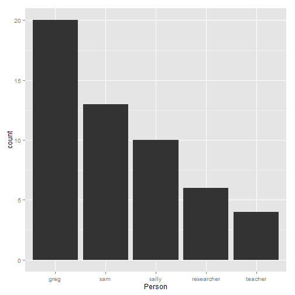
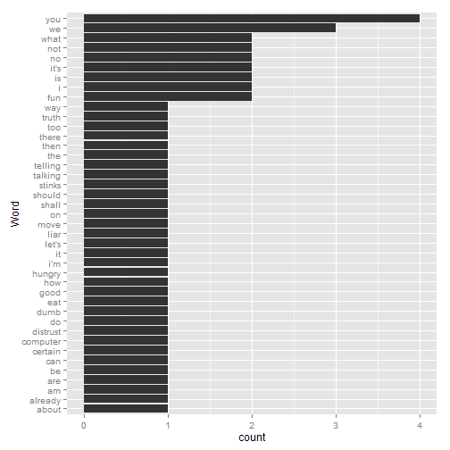
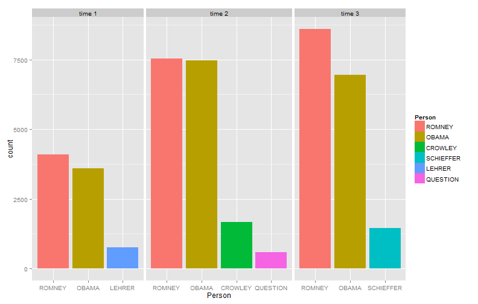
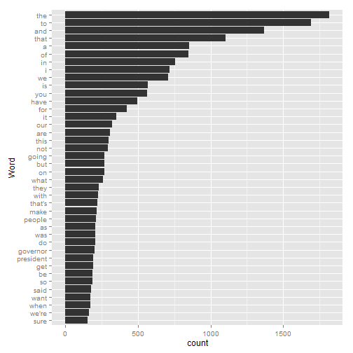

# word_freqs
### February 20, 2014

## Required Packages


```r
library(qdap)
library(devtools)
install_github("plotflow", "trinker")
library(plotflow)
```


## Example One


```r
dat_person <- with(DATA, wfm(state, person))
dat_person_b <- matrix2df(data.frame(colSums(dat_person)), "Person")
dat_person_c <- matrix2df(data.frame(rowSums(dat_person)), "Word")
colnames(dat_person_b)[2] <- colnames(dat_person_c)[2] <- "Freq"
ggplot(plotflow:::order_by(Person, ~-Freq, dat_person_b), aes(Person)) +
    geom_bar(aes(weight=Freq))  
```

 

```r
ggplot(plotflow:::order_by(Word, ~Freq, dat_person_c), aes(Word)) +
    geom_bar(aes(weight=Freq))  + coord_flip()
```

 


## Example Two


```r
dat_person2 <- with(pres_debates2012, wfm(dialogue, list(person, time)))
dat_person2_b <- colsplit2df(matrix2df(data.frame(colSums(dat_person2)), 
    "Person&Time"))
dat_person2_c <- matrix2df(data.frame(rowSums(dat_person2)), "Word")
colnames(dat_person2_b)[3] <- colnames(dat_person2_c)[2] <- "Freq"
dat_person2_c <- plotflow:::order_by(Word, ~-Freq, dat_person2_c)
dat_person2_d <- tail(dat_person2_c[order(dat_person2_c$Freq), ], 40)
ggplot(plotflow:::order_by(Person, ~-Freq, dat_person2_b, sum), aes(Person)) +
    geom_bar(aes(weight=Freq, fill=Person))  + 
    facet_grid(~Time, scales = "free", space = "free")
```

 


```r
ggplot(plotflow:::order_by(Word, ~Freq, dat_person2_d), aes(Word)) +
    geom_bar(aes(weight=Freq))  + coord_flip()
```

 


